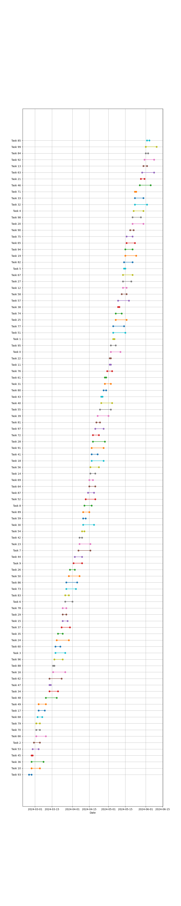

# Project 157 (PJ0157)

## Description

A historic building renovation preserving architectural heritage.

## Tasks

```json
[
    {
        "id": 0,
        "start_date": "2024-05-03",
        "end_date": "2024-05-11",
        "description": "Organize the design team meeting.",
        "deliverables": [
            "Presentations",
            "Models",
            "Estimations"
        ],
        "milestone": "Client Presentation",
        "dependencies": []
    },
    {
        "id": 1,
        "start_date": "2024-05-05",
        "end_date": "2024-05-06",
        "description": "Prepare the budget estimation report.",
        "deliverables": [
            "Presentations",
            "Plans"
        ],
        "milestone": "Schematic Design",
        "dependencies": [
            0
        ]
    },
    {
        "id": 2,
        "start_date": "2024-02-29",
        "end_date": "2024-03-05",
        "description": "Submit the permit application.",
        "deliverables": [
            "Schedules"
        ],
        "milestone": "Project Completion",
        "dependencies": [
            1,
            0
        ]
    },
    {
        "id": 3,
        "start_date": "2024-03-18",
        "end_date": "2024-03-26",
        "description": "Conduct a client review meeting.",
        "deliverables": [
            "Drawings",
            "Reports",
            "Plans"
        ],
        "milestone": "Schematic Design",
        "dependencies": [
            0
        ]
    },
    {
        "id": 4,
        "start_date": "2024-05-22",
        "end_date": "2024-05-30",
        "description": "Finalize the schematic design documents.",
        "deliverables": [
            "Applications",
            "Sketches"
        ],
        "milestone": "Schematic Design",
        "dependencies": []
    },
    {
        "id": 5,
        "start_date": "2024-05-14",
        "end_date": "2024-05-15",
        "description": "Finalize the schematic design documents.",
        "deliverables": [
            "Applications",
            "Estimations"
        ],
        "milestone": "Design Development",
        "dependencies": [
            0,
            1,
            4
        ]
    },
    {
        "id": 6,
        "start_date": "2024-03-26",
        "end_date": "2024-04-01",
        "description": "Coordinate with the engineering team.",
        "deliverables": [
            "Drawings",
            "Models",
            "Plans"
        ],
        "milestone": "Schematic Design",
        "dependencies": [
            0,
            5
        ]
    },
    {
        "id": 7,
        "start_date": "2024-04-06",
        "end_date": "2024-04-16",
        "description": "Organize the design team meeting.",
        "deliverables": [
            "Reports",
            "Sketches"
        ],
        "milestone": "Client Presentation",
        "dependencies": []
    },
    {
        "id": 8,
        "start_date": "2024-04-11",
        "end_date": "2024-04-17",
        "description": "Revise the project schedule.",
        "deliverables": [
            "Models",
            "Schedules",
            "Plans"
        ],
        "milestone": "Client Presentation",
        "dependencies": []
    },
    {
        "id": 9,
        "start_date": "2024-04-02",
        "end_date": "2024-04-09",
        "description": "Coordinate with the engineering team.",
        "deliverables": [
            "Sketches",
            "Reports",
            "Plans"
        ],
        "milestone": "Bid Phase",
        "dependencies": [
            2,
            4,
            7
        ]
    },
    {
        "id": 10,
        "start_date": "2024-02-27",
        "end_date": "2024-03-05",
        "description": "Submit the permit application.",
        "deliverables": [
            "Documents",
            "Reports"
        ],
        "milestone": "Project Completion",
        "dependencies": [
            1,
            4
        ]
    },
    {
        "id": 11,
        "start_date": "2024-05-02",
        "end_date": "2024-05-03",
        "description": "Revise the project schedule.",
        "deliverables": [
            "Presentations",
            "Plans"
        ],
        "milestone": "Client Presentation",
        "dependencies": []
    },
    {
        "id": 12,
        "start_date": "2024-05-13",
        "end_date": "2024-05-16",
        "description": "Finalize the schematic design documents.",
        "deliverables": [
            "Documents"
        ],
        "milestone": "Client Presentation",
        "dependencies": []
    },
    {
        "id": 13,
        "start_date": "2024-05-30",
        "end_date": "2024-06-02",
        "description": "Prepare the project presentation slides.",
        "deliverables": [
            "Models",
            "Drawings"
        ],
        "milestone": "Project Completion",
        "dependencies": [
            6,
            0,
            12
        ]
    },
    {
        "id": 14,
        "start_date": "2024-04-16",
        "end_date": "2024-04-20",
        "description": "Prepare the project presentation slides.",
        "deliverables": [
            "Drawings",
            "Applications"
        ],
        "milestone": "Construction Start",
        "dependencies": [
            10,
            0
        ]
    },
    {
        "id": 15,
        "start_date": "2024-03-24",
        "end_date": "2024-03-28",
        "description": "Prepare the project presentation slides.",
        "deliverables": [
            "Documents",
            "Estimations"
        ],
        "milestone": "Client Presentation",
        "dependencies": []
    },
    {
        "id": 16,
        "start_date": "2024-03-16",
        "end_date": "2024-03-26",
        "description": "Complete the initial design sketches.",
        "deliverables": [
            "Reports",
            "Documents",
            "Estimations"
        ],
        "milestone": "Permit Submission",
        "dependencies": [
            9,
            14,
            6
        ]
    },
    {
        "id": 17,
        "start_date": "2024-03-04",
        "end_date": "2024-03-09",
        "description": "Finalize the schematic design documents.",
        "deliverables": [
            "Plans"
        ],
        "milestone": "Construction Start",
        "dependencies": [
            7
        ]
    },
    {
        "id": 18,
        "start_date": "2024-04-17",
        "end_date": "2024-04-27",
        "description": "Finalize the schematic design documents.",
        "deliverables": [
            "Presentations",
            "Estimations"
        ],
        "milestone": "Construction Start",
        "dependencies": [
            7
        ]
    },
    {
        "id": 19,
        "start_date": "2024-05-15",
        "end_date": "2024-05-24",
        "description": "Finalize the schematic design documents.",
        "deliverables": [
            "Documents",
            "Estimations",
            "Sketches"
        ],
        "milestone": "Construction Documents",
        "dependencies": []
    },
    {
        "id": 20,
        "start_date": "2024-05-21",
        "end_date": "2024-05-30",
        "description": "Prepare the project presentation slides.",
        "deliverables": [
            "Reports",
            "Sketches",
            "Applications"
        ],
        "milestone": "Construction Start",
        "dependencies": [
            6,
            7
        ]
    },
    {
        "id": 21,
        "start_date": "2024-05-28",
        "end_date": "2024-05-31",
        "description": "Update the construction drawings.",
        "deliverables": [
            "Reports"
        ],
        "milestone": "Client Presentation",
        "dependencies": [
            15,
            20
        ]
    },
    {
        "id": 22,
        "start_date": "2024-05-02",
        "end_date": "2024-05-03",
        "description": "Submit the permit application.",
        "deliverables": [
            "Models",
            "Documents"
        ],
        "milestone": "Bid Phase",
        "dependencies": [
            10,
            14
        ]
    },
    {
        "id": 23,
        "start_date": "2024-04-07",
        "end_date": "2024-04-16",
        "description": "Prepare the budget estimation report.",
        "deliverables": [
            "Models",
            "Documents",
            "Plans"
        ],
        "milestone": "Construction Start",
        "dependencies": [
            7,
            8,
            4
        ]
    },
    {
        "id": 24,
        "start_date": "2024-03-19",
        "end_date": "2024-03-29",
        "description": "Conduct a client review meeting.",
        "deliverables": [
            "Plans",
            "Documents",
            "Estimations"
        ],
        "milestone": "Design Development",
        "dependencies": [
            9,
            16
        ]
    },
    {
        "id": 25,
        "start_date": "2024-05-07",
        "end_date": "2024-05-16",
        "description": "Organize the design team meeting.",
        "deliverables": [
            "Presentations",
            "Drawings"
        ],
        "milestone": "Project Completion",
        "dependencies": [
            2
        ]
    },
    {
        "id": 26,
        "start_date": "2024-03-30",
        "end_date": "2024-04-03",
        "description": "Prepare the project presentation slides.",
        "deliverables": [
            "Schedules",
            "Drawings",
            "Documents"
        ],
        "milestone": "Bid Phase",
        "dependencies": []
    },
    {
        "id": 27,
        "start_date": "2024-05-13",
        "end_date": "2024-05-20",
        "description": "Organize the design team meeting.",
        "deliverables": [
            "Plans",
            "Drawings",
            "Estimations"
        ],
        "milestone": "Client Presentation",
        "dependencies": [
            26,
            16,
            22
        ]
    },
    {
        "id": 28,
        "start_date": "2024-04-18",
        "end_date": "2024-04-28",
        "description": "Coordinate with the engineering team.",
        "deliverables": [
            "Estimations",
            "Sketches",
            "Models"
        ],
        "milestone": "Project Completion",
        "dependencies": [
            21
        ]
    },
    {
        "id": 29,
        "start_date": "2024-03-24",
        "end_date": "2024-03-27",
        "description": "Organize the design team meeting.",
        "deliverables": [
            "Documents",
            "Presentations",
            "Drawings"
        ],
        "milestone": "Design Development",
        "dependencies": [
            18
        ]
    },
    {
        "id": 30,
        "start_date": "2024-04-10",
        "end_date": "2024-04-19",
        "description": "Prepare the budget estimation report.",
        "deliverables": [
            "Documents",
            "Sketches"
        ],
        "milestone": "Design Development",
        "dependencies": [
            3
        ]
    },
    {
        "id": 31,
        "start_date": "2024-04-28",
        "end_date": "2024-05-03",
        "description": "Complete the initial design sketches.",
        "deliverables": [
            "Drawings"
        ],
        "milestone": "Construction Start",
        "dependencies": []
    },
    {
        "id": 32,
        "start_date": "2024-05-23",
        "end_date": "2024-06-02",
        "description": "Prepare the project presentation slides.",
        "deliverables": [
            "Estimations",
            "Drawings"
        ],
        "milestone": "Construction Start",
        "dependencies": [
            1,
            22
        ]
    },
    {
        "id": 33,
        "start_date": "2024-05-23",
        "end_date": "2024-05-30",
        "description": "Submit the permit application.",
        "deliverables": [
            "Applications"
        ],
        "milestone": "Project Completion",
        "dependencies": []
    },
    {
        "id": 34,
        "start_date": "2024-03-13",
        "end_date": "2024-03-20",
        "description": "Coordinate with the engineering team.",
        "deliverables": [
            "Schedules"
        ],
        "milestone": "Schematic Design",
        "dependencies": [
            24,
            33
        ]
    },
    {
        "id": 35,
        "start_date": "2024-03-20",
        "end_date": "2024-03-24",
        "description": "Revise the project schedule.",
        "deliverables": [
            "Applications",
            "Presentations",
            "Plans"
        ],
        "milestone": "Project Completion",
        "dependencies": []
    },
    {
        "id": 36,
        "start_date": "2024-02-27",
        "end_date": "2024-03-08",
        "description": "Revise the project schedule.",
        "deliverables": [
            "Plans",
            "Models",
            "Documents"
        ],
        "milestone": "Construction Documents",
        "dependencies": [
            24,
            34,
            10
        ]
    },
    {
        "id": 37,
        "start_date": "2024-03-23",
        "end_date": "2024-03-30",
        "description": "Revise the project schedule.",
        "deliverables": [
            "Schedules",
            "Drawings"
        ],
        "milestone": "Project Completion",
        "dependencies": [
            12,
            16
        ]
    },
    {
        "id": 38,
        "start_date": "2024-05-09",
        "end_date": "2024-05-10",
        "description": "Finalize the schematic design documents.",
        "deliverables": [
            "Applications",
            "Sketches",
            "Drawings"
        ],
        "milestone": "Bid Phase",
        "dependencies": [
            30,
            2,
            11
        ]
    },
    {
        "id": 39,
        "start_date": "2024-04-22",
        "end_date": "2024-05-01",
        "description": "Finalize the schematic design documents.",
        "deliverables": [
            "Schedules",
            "Reports",
            "Documents"
        ],
        "milestone": "Project Completion",
        "dependencies": [
            0,
            3,
            31
        ]
    },
    {
        "id": 40,
        "start_date": "2024-04-25",
        "end_date": "2024-05-04",
        "description": "Complete the initial design sketches.",
        "deliverables": [
            "Models",
            "Documents",
            "Sketches"
        ],
        "milestone": "Schematic Design",
        "dependencies": []
    },
    {
        "id": 41,
        "start_date": "2024-04-17",
        "end_date": "2024-04-22",
        "description": "Complete the initial design sketches.",
        "deliverables": [
            "Estimations",
            "Applications",
            "Schedules"
        ],
        "milestone": "Design Development",
        "dependencies": []
    },
    {
        "id": 42,
        "start_date": "2024-04-07",
        "end_date": "2024-04-09",
        "description": "Complete the initial design sketches.",
        "deliverables": [
            "Schedules",
            "Plans"
        ],
        "milestone": "Permit Submission",
        "dependencies": [
            6,
            1
        ]
    },
    {
        "id": 43,
        "start_date": "2024-04-25",
        "end_date": "2024-04-26",
        "description": "Organize the design team meeting.",
        "deliverables": [
            "Schedules",
            "Models"
        ],
        "milestone": "Schematic Design",
        "dependencies": []
    },
    {
        "id": 44,
        "start_date": "2024-04-03",
        "end_date": "2024-04-09",
        "description": "Complete the initial design sketches.",
        "deliverables": [
            "Schedules",
            "Drawings"
        ],
        "milestone": "Client Presentation",
        "dependencies": [
            11,
            31
        ]
    },
    {
        "id": 45,
        "start_date": "2024-02-27",
        "end_date": "2024-02-28",
        "description": "Revise the project schedule.",
        "deliverables": [
            "Presentations",
            "Models"
        ],
        "milestone": "Construction Start",
        "dependencies": [
            23
        ]
    },
    {
        "id": 46,
        "start_date": "2024-05-27",
        "end_date": "2024-06-05",
        "description": "Coordinate with the engineering team.",
        "deliverables": [
            "Documents",
            "Sketches",
            "Schedules"
        ],
        "milestone": "Project Completion",
        "dependencies": [
            40,
            30
        ]
    },
    {
        "id": 47,
        "start_date": "2024-03-13",
        "end_date": "2024-03-14",
        "description": "Submit the permit application.",
        "deliverables": [
            "Drawings",
            "Presentations",
            "Plans"
        ],
        "milestone": "Schematic Design",
        "dependencies": [
            24,
            30,
            27
        ]
    },
    {
        "id": 48,
        "start_date": "2024-03-10",
        "end_date": "2024-03-19",
        "description": "Submit the permit application.",
        "deliverables": [
            "Applications",
            "Reports"
        ],
        "milestone": "Permit Submission",
        "dependencies": [
            19,
            11,
            46
        ]
    },
    {
        "id": 49,
        "start_date": "2024-03-04",
        "end_date": "2024-03-10",
        "description": "Conduct a client review meeting.",
        "deliverables": [
            "Applications",
            "Sketches",
            "Reports"
        ],
        "milestone": "Construction Documents",
        "dependencies": [
            9
        ]
    },
    {
        "id": 50,
        "start_date": "2024-03-29",
        "end_date": "2024-04-07",
        "description": "Conduct a client review meeting.",
        "deliverables": [
            "Drawings",
            "Reports"
        ],
        "milestone": "Schematic Design",
        "dependencies": []
    },
    {
        "id": 51,
        "start_date": "2024-05-05",
        "end_date": "2024-05-15",
        "description": "Organize the design team meeting.",
        "deliverables": [
            "Applications",
            "Sketches"
        ],
        "milestone": "Client Presentation",
        "dependencies": [
            37,
            27
        ]
    },
    {
        "id": 52,
        "start_date": "2024-04-12",
        "end_date": "2024-04-20",
        "description": "Prepare the project presentation slides.",
        "deliverables": [
            "Estimations"
        ],
        "milestone": "Project Completion",
        "dependencies": [
            19,
            13,
            29
        ]
    },
    {
        "id": 53,
        "start_date": "2024-02-28",
        "end_date": "2024-03-04",
        "description": "Submit the permit application.",
        "deliverables": [
            "Drawings"
        ],
        "milestone": "Client Presentation",
        "dependencies": []
    },
    {
        "id": 54,
        "start_date": "2024-04-09",
        "end_date": "2024-04-11",
        "description": "Update the construction drawings.",
        "deliverables": [
            "Documents",
            "Applications"
        ],
        "milestone": "Construction Documents",
        "dependencies": [
            26,
            46,
            45
        ]
    },
    {
        "id": 55,
        "start_date": "2024-04-24",
        "end_date": "2024-05-03",
        "description": "Complete the initial design sketches.",
        "deliverables": [
            "Plans",
            "Presentations",
            "Applications"
        ],
        "milestone": "Permit Submission",
        "dependencies": [
            13,
            8,
            18
        ]
    },
    {
        "id": 56,
        "start_date": "2024-04-16",
        "end_date": "2024-04-23",
        "description": "Prepare the project presentation slides.",
        "deliverables": [
            "Schedules",
            "Reports",
            "Plans"
        ],
        "milestone": "Schematic Design",
        "dependencies": []
    },
    {
        "id": 57,
        "start_date": "2024-05-09",
        "end_date": "2024-05-18",
        "description": "Prepare the project presentation slides.",
        "deliverables": [
            "Presentations",
            "Schedules"
        ],
        "milestone": "Schematic Design",
        "dependencies": [
            11,
            12,
            17
        ]
    },
    {
        "id": 58,
        "start_date": "2024-05-12",
        "end_date": "2024-05-16",
        "description": "Update the construction drawings.",
        "deliverables": [
            "Models",
            "Applications"
        ],
        "milestone": "Construction Documents",
        "dependencies": [
            19,
            9
        ]
    },
    {
        "id": 59,
        "start_date": "2024-04-10",
        "end_date": "2024-04-12",
        "description": "Organize the design team meeting.",
        "deliverables": [
            "Applications",
            "Models"
        ],
        "milestone": "Construction Start",
        "dependencies": [
            22,
            44
        ]
    },
    {
        "id": 60,
        "start_date": "2024-03-18",
        "end_date": "2024-03-22",
        "description": "Organize the design team meeting.",
        "deliverables": [
            "Applications"
        ],
        "milestone": "Client Presentation",
        "dependencies": [
            47,
            31
        ]
    },
    {
        "id": 61,
        "start_date": "2024-04-28",
        "end_date": "2024-04-29",
        "description": "Conduct a client review meeting.",
        "deliverables": [
            "Reports",
            "Plans"
        ],
        "milestone": "Construction Documents",
        "dependencies": []
    },
    {
        "id": 62,
        "start_date": "2024-03-13",
        "end_date": "2024-03-23",
        "description": "Complete the initial design sketches.",
        "deliverables": [
            "Presentations"
        ],
        "milestone": "Permit Submission",
        "dependencies": [
            29,
            4,
            35
        ]
    },
    {
        "id": 63,
        "start_date": "2024-05-29",
        "end_date": "2024-06-08",
        "description": "Finalize the schematic design documents.",
        "deliverables": [
            "Estimations"
        ],
        "milestone": "Design Development",
        "dependencies": []
    },
    {
        "id": 64,
        "start_date": "2024-04-15",
        "end_date": "2024-04-20",
        "description": "Conduct a client review meeting.",
        "deliverables": [
            "Applications",
            "Estimations"
        ],
        "milestone": "Construction Documents",
        "dependencies": [
            24
        ]
    },
    {
        "id": 65,
        "start_date": "2024-05-16",
        "end_date": "2024-05-23",
        "description": "Organize the design team meeting.",
        "deliverables": [
            "Documents"
        ],
        "milestone": "Construction Documents",
        "dependencies": [
            32,
            44
        ]
    },
    {
        "id": 66,
        "start_date": "2024-03-02",
        "end_date": "2024-03-10",
        "description": "Finalize the schematic design documents.",
        "deliverables": [
            "Drawings",
            "Estimations"
        ],
        "milestone": "Schematic Design",
        "dependencies": [
            48,
            23
        ]
    },
    {
        "id": 67,
        "start_date": "2024-05-13",
        "end_date": "2024-05-21",
        "description": "Prepare the project presentation slides.",
        "deliverables": [
            "Sketches",
            "Plans"
        ],
        "milestone": "Construction Start",
        "dependencies": [
            24,
            27,
            10
        ]
    },
    {
        "id": 68,
        "start_date": "2024-03-03",
        "end_date": "2024-03-07",
        "description": "Coordinate with the engineering team.",
        "deliverables": [
            "Reports",
            "Sketches",
            "Presentations"
        ],
        "milestone": "Client Presentation",
        "dependencies": [
            52,
            23,
            40
        ]
    },
    {
        "id": 69,
        "start_date": "2024-04-15",
        "end_date": "2024-04-18",
        "description": "Conduct a client review meeting.",
        "deliverables": [
            "Applications"
        ],
        "milestone": "Permit Submission",
        "dependencies": []
    },
    {
        "id": 70,
        "start_date": "2024-03-02",
        "end_date": "2024-03-05",
        "description": "Submit the permit application.",
        "deliverables": [
            "Drawings",
            "Presentations"
        ],
        "milestone": "Permit Submission",
        "dependencies": [
            33,
            60
        ]
    },
    {
        "id": 71,
        "start_date": "2024-05-23",
        "end_date": "2024-05-24",
        "description": "Update the construction drawings.",
        "deliverables": [
            "Sketches",
            "Models"
        ],
        "milestone": "Bid Phase",
        "dependencies": [
            42,
            50,
            12
        ]
    },
    {
        "id": 72,
        "start_date": "2024-04-18",
        "end_date": "2024-04-23",
        "description": "Finalize the schematic design documents.",
        "deliverables": [
            "Estimations",
            "Sketches",
            "Drawings"
        ],
        "milestone": "Schematic Design",
        "dependencies": []
    },
    {
        "id": 73,
        "start_date": "2024-03-27",
        "end_date": "2024-04-04",
        "description": "Complete the initial design sketches.",
        "deliverables": [
            "Applications",
            "Schedules"
        ],
        "milestone": "Construction Documents",
        "dependencies": [
            5
        ]
    },
    {
        "id": 74,
        "start_date": "2024-05-07",
        "end_date": "2024-05-12",
        "description": "Finalize the schematic design documents.",
        "deliverables": [
            "Models"
        ],
        "milestone": "Construction Documents",
        "dependencies": []
    },
    {
        "id": 75,
        "start_date": "2024-05-16",
        "end_date": "2024-05-21",
        "description": "Prepare the budget estimation report.",
        "deliverables": [
            "Drawings",
            "Applications",
            "Sketches"
        ],
        "milestone": "Schematic Design",
        "dependencies": [
            30,
            51
        ]
    },
    {
        "id": 76,
        "start_date": "2024-04-30",
        "end_date": "2024-05-04",
        "description": "Update the construction drawings.",
        "deliverables": [
            "Schedules",
            "Drawings"
        ],
        "milestone": "Permit Submission",
        "dependencies": [
            28,
            8
        ]
    },
    {
        "id": 77,
        "start_date": "2024-05-05",
        "end_date": "2024-05-14",
        "description": "Submit the permit application.",
        "deliverables": [
            "Documents",
            "Applications",
            "Sketches"
        ],
        "milestone": "Construction Start",
        "dependencies": [
            63,
            28,
            14
        ]
    },
    {
        "id": 78,
        "start_date": "2024-03-24",
        "end_date": "2024-03-27",
        "description": "Prepare the project presentation slides.",
        "deliverables": [
            "Reports",
            "Applications",
            "Models"
        ],
        "milestone": "Design Development",
        "dependencies": []
    },
    {
        "id": 79,
        "start_date": "2024-03-02",
        "end_date": "2024-03-05",
        "description": "Update the construction drawings.",
        "deliverables": [
            "Reports",
            "Schedules"
        ],
        "milestone": "Permit Submission",
        "dependencies": [
            33,
            0,
            7
        ]
    },
    {
        "id": 80,
        "start_date": "2024-04-27",
        "end_date": "2024-04-29",
        "description": "Organize the design team meeting.",
        "deliverables": [
            "Sketches",
            "Presentations"
        ],
        "milestone": "Construction Start",
        "dependencies": [
            31,
            43
        ]
    },
    {
        "id": 81,
        "start_date": "2024-04-21",
        "end_date": "2024-04-24",
        "description": "Conduct a client review meeting.",
        "deliverables": [
            "Reports",
            "Presentations"
        ],
        "milestone": "Construction Start",
        "dependencies": []
    },
    {
        "id": 82,
        "start_date": "2024-05-14",
        "end_date": "2024-05-21",
        "description": "Coordinate with the engineering team.",
        "deliverables": [
            "Models",
            "Plans"
        ],
        "milestone": "Construction Documents",
        "dependencies": [
            9
        ]
    },
    {
        "id": 83,
        "start_date": "2024-03-26",
        "end_date": "2024-03-29",
        "description": "Revise the project schedule.",
        "deliverables": [
            "Applications",
            "Sketches"
        ],
        "milestone": "Construction Start",
        "dependencies": [
            61,
            28,
            4
        ]
    },
    {
        "id": 84,
        "start_date": "2024-06-01",
        "end_date": "2024-06-03",
        "description": "Update the construction drawings.",
        "deliverables": [
            "Documents",
            "Drawings"
        ],
        "milestone": "Project Completion",
        "dependencies": []
    },
    {
        "id": 85,
        "start_date": "2024-06-02",
        "end_date": "2024-06-04",
        "description": "Conduct a client review meeting.",
        "deliverables": [
            "Drawings"
        ],
        "milestone": "Construction Documents",
        "dependencies": [
            17
        ]
    },
    {
        "id": 86,
        "start_date": "2024-03-27",
        "end_date": "2024-04-05",
        "description": "Organize the design team meeting.",
        "deliverables": [
            "Reports",
            "Plans",
            "Estimations"
        ],
        "milestone": "Bid Phase",
        "dependencies": []
    },
    {
        "id": 87,
        "start_date": "2024-04-14",
        "end_date": "2024-04-19",
        "description": "Finalize the schematic design documents.",
        "deliverables": [
            "Models"
        ],
        "milestone": "Client Presentation",
        "dependencies": [
            30,
            15
        ]
    },
    {
        "id": 88,
        "start_date": "2024-03-16",
        "end_date": "2024-03-17",
        "description": "Organize the design team meeting.",
        "deliverables": [
            "Models"
        ],
        "milestone": "Project Completion",
        "dependencies": [
            41,
            14,
            7
        ]
    },
    {
        "id": 89,
        "start_date": "2024-04-10",
        "end_date": "2024-04-15",
        "description": "Revise the project schedule.",
        "deliverables": [
            "Schedules"
        ],
        "milestone": "Bid Phase",
        "dependencies": [
            59,
            21,
            23
        ]
    },
    {
        "id": 90,
        "start_date": "2024-05-19",
        "end_date": "2024-05-22",
        "description": "Submit the permit application.",
        "deliverables": [
            "Estimations",
            "Drawings"
        ],
        "milestone": "Client Presentation",
        "dependencies": [
            55,
            33,
            81
        ]
    },
    {
        "id": 91,
        "start_date": "2024-04-17",
        "end_date": "2024-04-27",
        "description": "Organize the design team meeting.",
        "deliverables": [
            "Models",
            "Drawings"
        ],
        "milestone": "Project Completion",
        "dependencies": [
            82
        ]
    },
    {
        "id": 92,
        "start_date": "2024-05-31",
        "end_date": "2024-06-08",
        "description": "Finalize the schematic design documents.",
        "deliverables": [
            "Sketches"
        ],
        "milestone": "Schematic Design",
        "dependencies": [
            60,
            74,
            13
        ]
    },
    {
        "id": 93,
        "start_date": "2024-02-25",
        "end_date": "2024-02-27",
        "description": "Coordinate with the engineering team.",
        "deliverables": [
            "Plans"
        ],
        "milestone": "Design Development",
        "dependencies": [
            26,
            3
        ]
    },
    {
        "id": 94,
        "start_date": "2024-05-15",
        "end_date": "2024-05-21",
        "description": "Coordinate with the engineering team.",
        "deliverables": [
            "Drawings",
            "Sketches"
        ],
        "milestone": "Permit Submission",
        "dependencies": []
    },
    {
        "id": 95,
        "start_date": "2024-05-03",
        "end_date": "2024-05-07",
        "description": "Prepare the budget estimation report.",
        "deliverables": [
            "Estimations",
            "Schedules",
            "Sketches"
        ],
        "milestone": "Schematic Design",
        "dependencies": [
            60,
            31,
            13
        ]
    },
    {
        "id": 96,
        "start_date": "2024-03-17",
        "end_date": "2024-03-24",
        "description": "Organize the design team meeting.",
        "deliverables": [
            "Applications",
            "Presentations",
            "Reports"
        ],
        "milestone": "Construction Start",
        "dependencies": [
            4,
            90,
            24
        ]
    },
    {
        "id": 97,
        "start_date": "2024-04-20",
        "end_date": "2024-04-27",
        "description": "Organize the design team meeting.",
        "deliverables": [
            "Documents",
            "Estimations",
            "Reports"
        ],
        "milestone": "Construction Start",
        "dependencies": [
            93,
            42
        ]
    },
    {
        "id": 98,
        "start_date": "2024-05-21",
        "end_date": "2024-05-28",
        "description": "Finalize the schematic design documents.",
        "deliverables": [
            "Reports",
            "Sketches",
            "Applications"
        ],
        "milestone": "Design Development",
        "dependencies": [
            80
        ]
    },
    {
        "id": 99,
        "start_date": "2024-06-01",
        "end_date": "2024-06-10",
        "description": "Prepare the budget estimation report.",
        "deliverables": [
            "Applications"
        ],
        "milestone": "Project Completion",
        "dependencies": []
    }
]
```

## Timeline


